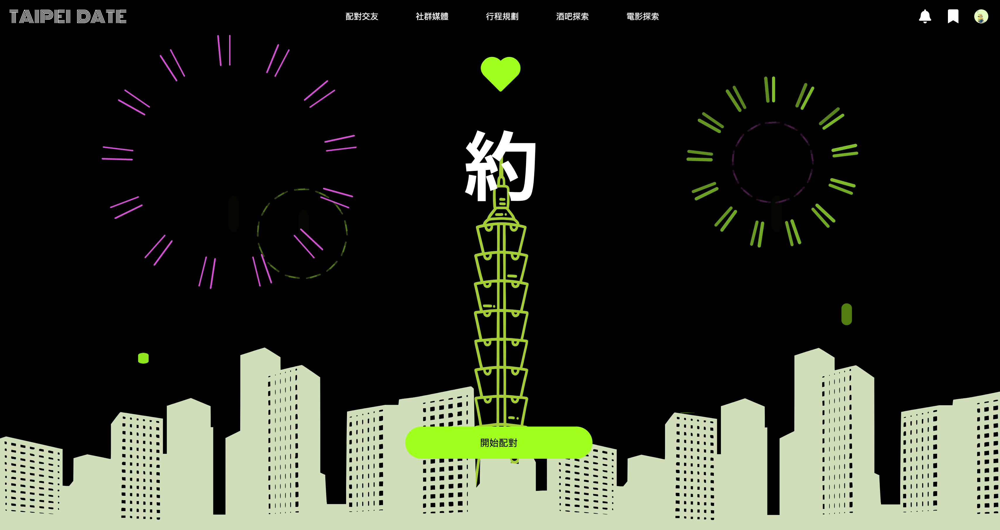
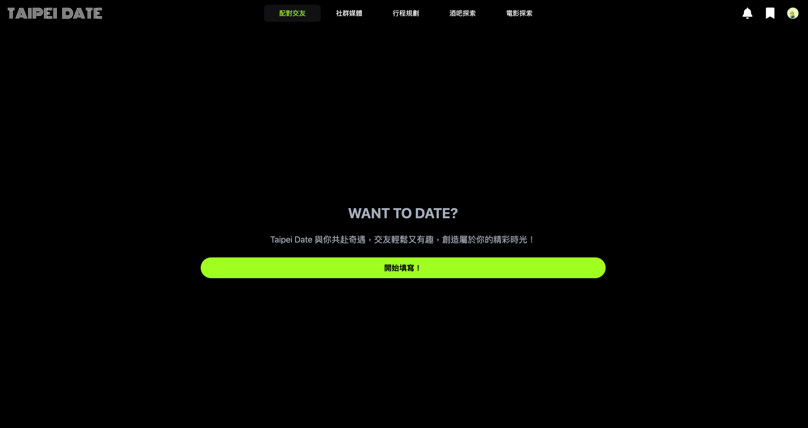
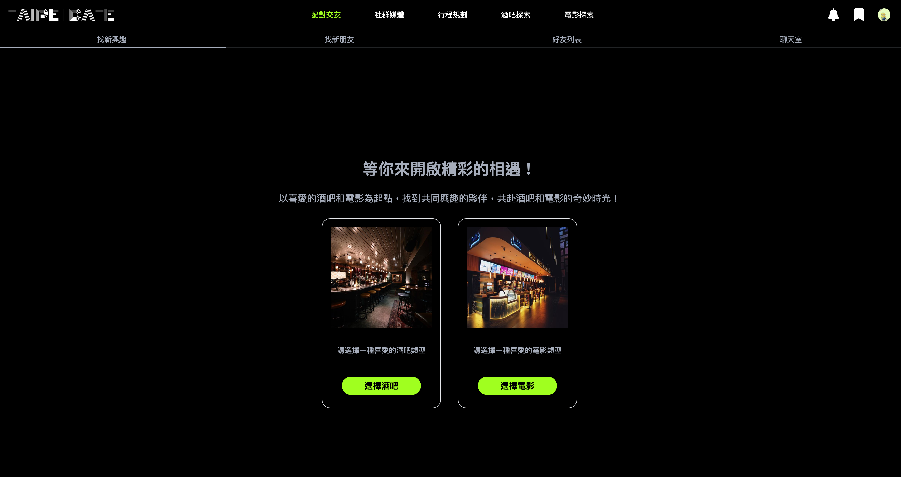
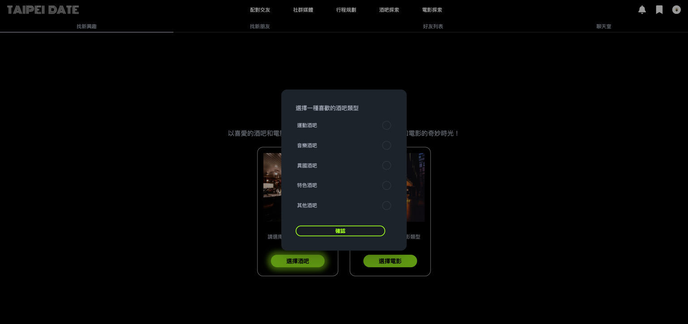
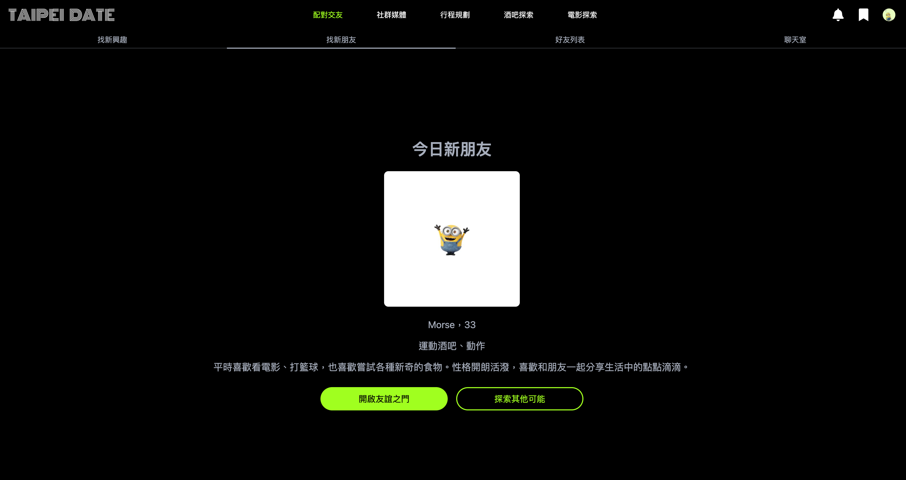
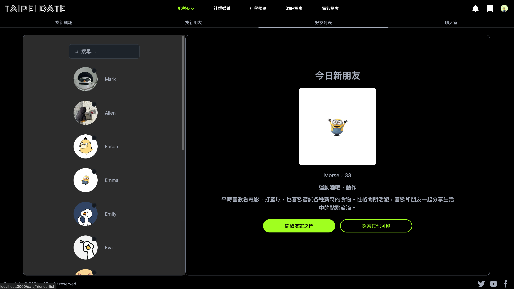
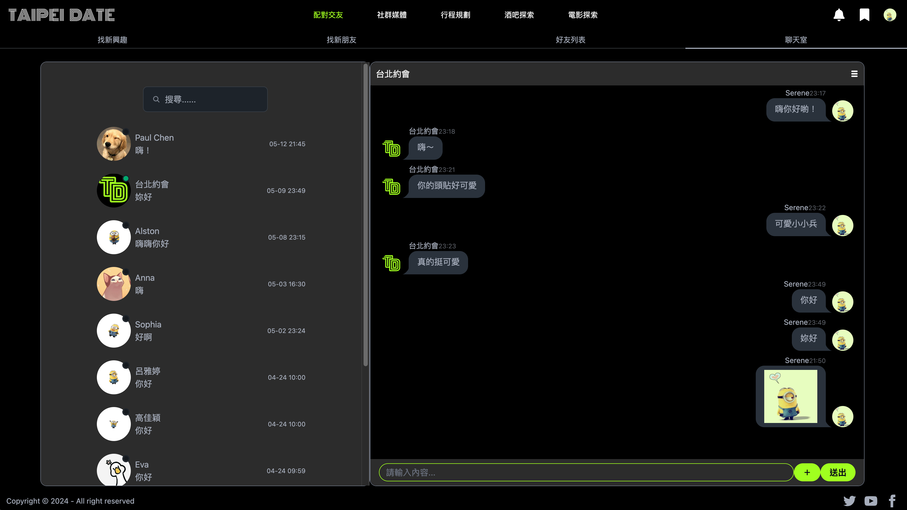
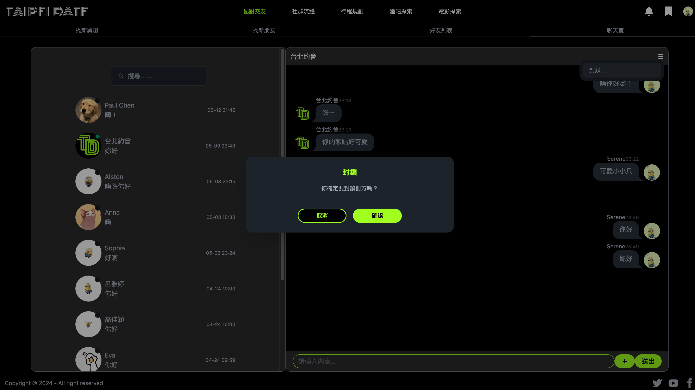

# Dating Platform for final topic

## 📋 Description

This Repo is a course exercise topic. (iSpan front-end engineer development course, final topic.)

The topic is Date in Taipei, which focuses on matching and making friends, using the same interests in bars and movies to find new friends, while social software and itinerary planning are supplemented to arrange date itineraries.

The functions I am mainly responsible for are matchmaking and one-on-one chat rooms.

The front-end uses Next.js to build the website, the back-end uses Express.js to write the API, and the database uses MySQL. The above technologies are used to complete a website platform.

## 🔍 Function

Matchmaking and one-on-one chat rooms

- The front end uses socket.io-client.
- The backend uses socket.io.

Chat room features:

- Online display.
- Sending text messages and pictures.
- The other party is typing.
- Blocking.

## 🛠️ Technologies & Requirements

Front-end

- React
- Next.js
- socket.io-client
- Tailwind CSS

Back-end

- Node.js
- Express.js
- cors
- jsonwebtoken
- MySQL
- socket.io

## 💻 Demo Screenshot

Demo:[Demo Video](https://reurl.cc/r99nrZ)



















## 🚀 Getting Started

1. Download ZIP or git clone

2. Front-end

- Install the packages

```
$ npm install.
```

3. Run the server

```
$ npm run dev.
```

4. Back-end

- Install the packages

```
$ npm install.
```

5. Run the server

```
$ npm run dev.
```

6. Socket

- Run the server

```
$ npm run socket.
```

7.  Open http://localhost:3000 to view it in your browser.

## 👤 Author

Email:yiting536@gmail.com

## ⭕️ Warning

The pictures used are purely for practice and homework purposes and have no commercial purpose or profit-making effect.Thanks!

## ⛔️ Notice

For security reasons, remove security-related content, such as the location of Google OAuth Client ID and Client Secret.

Therefore, some content may not be available for normal use.

Some pictures have been removed, so some parts of the pictures will not be displayed properly.
